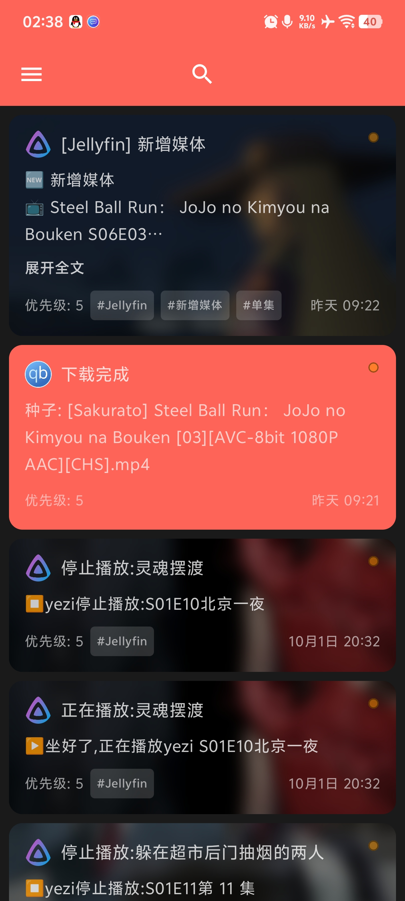
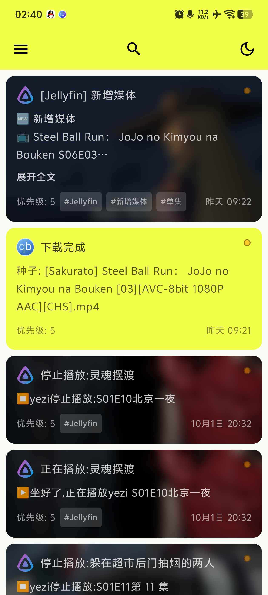
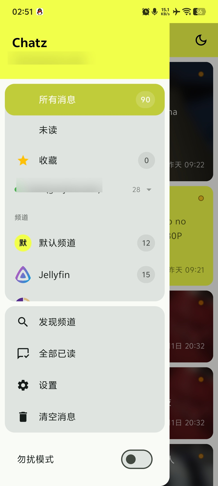
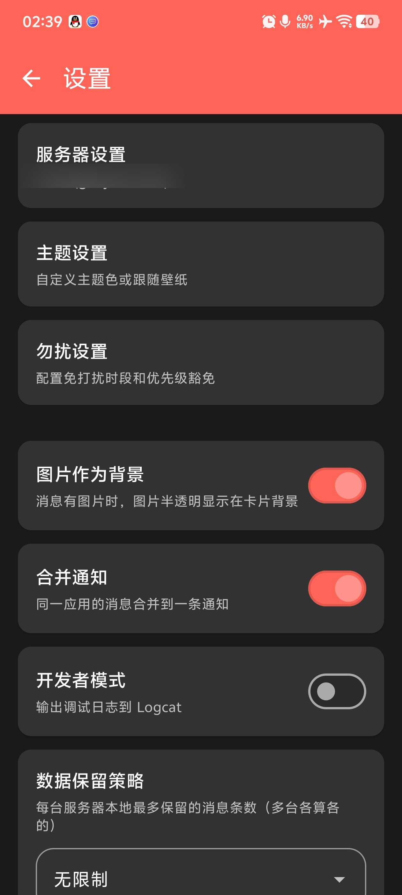

# Chatz

English | [简体中文](README.md)

An Android client for self-hosted message push. One app, several servers, one inbox.

Supported backends:

- **Chatz** — native support: channels, read state, archive, unread counts, message aggregation, tags, devices and routing rules
- **Gotify** — compatible with its HTTP + WebSocket protocol
- **ntfy** — subscribe by topic

> The client only receives and manages messages. Where those messages come from is entirely up to your own server — nothing is relayed through a third-party service.

## Features

**Multiple servers**

- Each server is a "card" you can enable or pause independently
- Server type is auto-detected on add (a `/config` probe decides whether it is Chatz; otherwise Gotify is assumed)
- Custom display name, automatic keep-alive interval (45s on Wi-Fi / 180s on mobile)

**Channels (Chatz)**

- Discover, subscribe, unsubscribe
- Channel password and channel icon
- Per-channel do-not-disturb

**Messages**

- Markdown rendering, image and attachment preview
- Read / unread, mark all read, archive / unarchive
- Full-text search (Room FTS)
- Paged loading (Paging 3)
- Aggregation and collapsing, tags, sender role badge (super admin / admin)
- Inline reply, draft retention, bubble notifications

**Do not disturb**

- Global switch plus a time window (start/end time, weekdays)
- Per-app rules, or scoped to a single channel

**More**

- Home screen widget (recent messages)
- Custom theme color, dark mode
- Auto-start on boot, foreground service keep-alive, automatic reconnect on network change
- Reply directly from the notification

## Screenshots

| Message list | Custom theme color |
|---|---|
|  |  |
| **Drawer & channels** | **Settings** |
|  |  |

## Download

Grab the latest `Chatz-<version>.apk` from the [Releases](../../releases) page, install it, and enter your own server address.

- Package: `asia.guojuice.yezigotify`
- Requires Android 7.0 (API 24) or above

## Getting started

1. Install the APK and grant the notification permission
2. Add a server → pick the type (Chatz / Gotify / ntfy)
3. Fill in the address and credentials:
   - **Chatz**: username + password, or a token
   - **Gotify**: application token / client token
   - **ntfy**: server address + topic (username/password if authentication is required)
4. Save — the connection starts immediately and messages arrive in real time

The companion **Chatz server** is open source: [github.com/yezi8430/Chatz](https://github.com/yezi8430/Chatz).

## Permissions

| Permission | Why |
|---|---|
| `INTERNET` | Talk to your server |
| `ACCESS_NETWORK_STATE` / `ACCESS_WIFI_STATE` | Pick keep-alive interval and reconnect |
| `POST_NOTIFICATIONS` | Post notifications (Android 13+) |
| `FOREGROUND_SERVICE(_SPECIAL_USE)` | Keep the connection alive |
| `WAKE_LOCK` | Avoid being cut off while idle |
| `RECEIVE_BOOT_COMPLETED` | Restore the connection after reboot |
| `SCHEDULE_EXACT_ALARM` | Do-not-disturb windows and keep-alive scheduling |
| `VIBRATE` | Notification vibration |
| `REQUEST_IGNORE_BATTERY_OPTIMIZATIONS` | Optional, to stop battery optimizers killing the connection |

No location, contacts, or call-log permissions.

## Privacy

- **No analytics, crash reporting, or telemetry SDKs.** The app only talks to the servers you configure
- Messages live in a local Room database
- Server addresses and credentials are encrypted with AES‑256‑GCM, key held in the Android Keystore (non-exportable); `allowBackup` is off so nothing lands in cloud backups
- See [PRIVACY.md](PRIVACY.md) for details

## Source

This repo currently holds documentation and release artifacts only — **the source is not public yet**. Build instructions will be added here once it is.

## Stack

Kotlin · Jetpack Compose (Material 3) · Room 3 + FTS · Paging 3 · OkHttp / Retrofit · Gson · Markwon · Glide · Kotlin Coroutines

`minSdk 24` / `targetSdk 34` / `compileSdk 37`

## License

[MIT](LICENSE)
